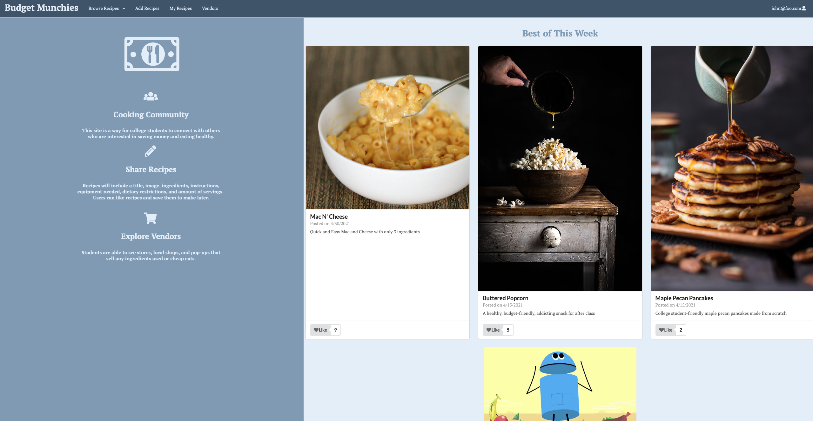

Budget Munchies is a web application created to provide an easy, accessible platform for college students to view, add and save simple and healthy recipes. 

This application allows for users to create an account to view, save and add recipes for others to see. It is a web application deployed with HTTPS and uses Javascript, React, Meteor and MongoDB. 

As a group, we worked through many challenges such as, meeting deadline requirements, obtaining technical solutions for the application, coordinating with each others schedules. My main task was to handle the deployment side of the application and work and triage issues in the database between development and production.

