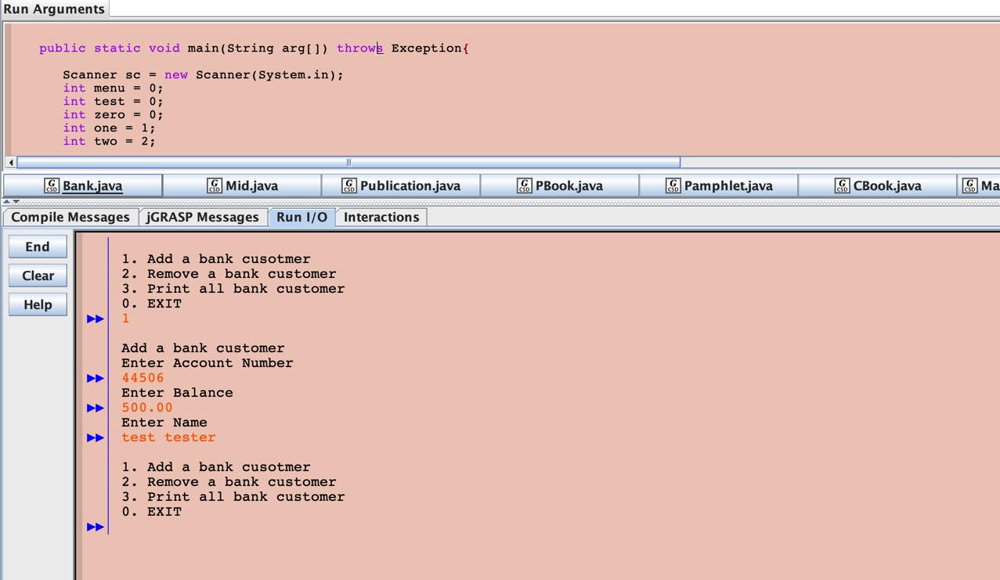

A command line program simulating adding and maintaing customers for a bank. 

This program features the ability to add, delete and show all customers in the bank with error checking. Each customer conatins an account number, a balance and a name. 

Source Code: coming soon 
